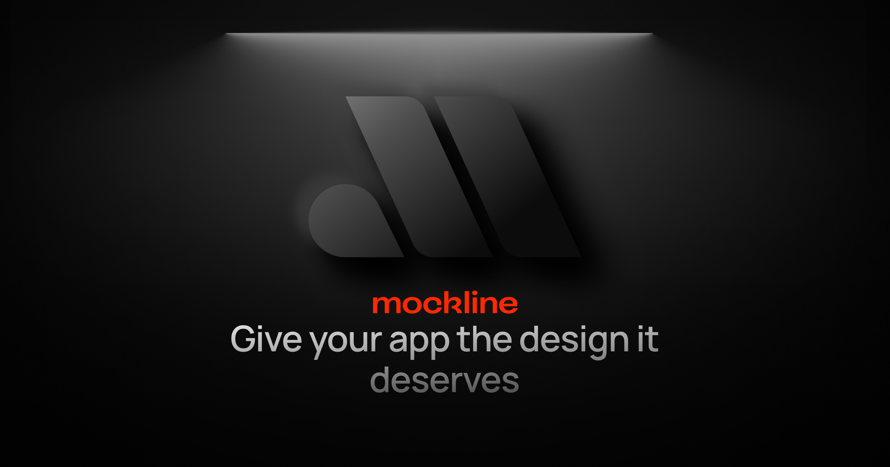

<p align="center">
  <a aria-label="NPM version" href="https://www.npmjs.com/package/mockline">
    
  </a>
  <a aria-label="License" href="https://github.com/mockline/mockline/main/LICENSE">
    
    </a>
  <a aria-label="Join the community on Discord" href="https://discord.gg/BkgyMzvJ3p">
    
  </a>
  <a aria-label="Mockline logo" href="https://mockline.dev/">
    
  </a>
  <a aria-label="Follow Hugo on Twitter" href="https://twitter.com/HugoRCD__">
    
  </a>
</p>

Welcome to Mockline, your go-to design library crafted to elevate your creative journey. Whether you're a seasoned designer or a budding developer, Mockline is designed to empower you with efficient, innovative, and collaborative tools, putting the joy back into the design process.


## Getting Started

Visit [mockline.dev](https://mockline.dev) to get started with Mockline.

## Contributing

See [CONTRIBUTING.md](./CONTRIBUTING.md) for more information.

## Community

The Mockline community can be found on Discord, to chat with other community members, you can join the [Mockline Discord](https://discord.gg/BkgyMzvJ3p).

## Features

- **Fully customizable**: All components are customizable via props and slots.
- **Lightweight**: No external CSS file. All styles are generated via Tailwind CSS.
- **Fully typed**: Written in TypeScript with predictable static types.
- **Developer friendly**: Fully documented and easy to contribute.
- **SSR**: Server-side rendering supported.
- **Dark mode**: Dark mode supported.

## Quick Setup

For the moment Mockline is only available for Nuxt projects (Vue 3 support and react support will be added soon).
To get started, follow these steps:


1. Add `mockline` dependency to your project

```bash
# Using bun
bun install -D mockline

# Using pnpm
pnpm add -D mockline

# Using yarn
yarn add --dev mockline

# Using npm
npm install --save-dev mockline
```

2. Add `@nuxtjs/mockline` to the `modules` section of `nuxt.config.ts`

```js
export default defineNuxtConfig({
  modules: [
    'mockline'
  ]
})
```

That's it! You can now use Mockline in your Nuxt app ✨

## Authors

**Mockline Module**

- Hugo Richard ([@HugoRCD__](https://x.com/HugoRCD__))