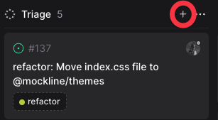
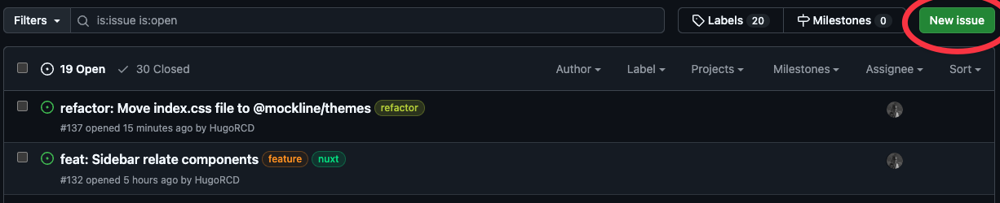

# Change of Ticketing Tool

We are transitioning from Linear to Volta for ticket management.

## Why this change?

### We have chosen to change tools for several reasons:
- Linear's pricing model restricts access to essential features, while Volta offers core functionality without cost barriers
- As an open-source project ourselves, Volta's open-source philosophy and GitHub-centric approach aligns with our values
- Volta provides seamless GitHub integration, allowing direct issue creation and management from either platform
- Enhanced collaboration features with built-in repository tracking and issue management in one unified interface

## Key Benefits of Volta:
- Native GitHub integration for streamlined workflow
- Simplified issue tracking across repositories
- Open-source friendly environment
- Direct repository synchronization
- Unified platform for both private and open-source projects

## How will this transition take place?

We have migrated all issues from Linear to Volta. Therefore, you can find all the issues you created on Linear now on Volta.

## How to access Volta?

You can access Volta by clicking on the following link: [Volta](https://volta.net/Mockline/mockline)

## How to create an issue?

To create an issue, simply click on the "New Issue" button at the top right of the page.

Alternatively, you can create a new issue directly from GitHub in the Mockline repository:

## Additional Features in Volta

### GitHub-Centric Workflow
- Direct integration with GitHub repositories
- Automatic synchronization of issues and pull requests
- Ability to reference and link issues across repositories

### Enhanced Collaboration
- Real-time updates and notifications
- Team-wide visibility on issue status
- Integrated commenting and discussion features

### Project Management
- Customizable project views
- Sprint planning capabilities
- Progress tracking and reporting
- Milestone management

## Best Practices for Using Volta

### Issue Creation
1. Use clear and descriptive titles
2. Add appropriate labels for categorization
3. Include relevant screenshots or documentation
4. Link related issues when applicable

### Issue Management
1. Keep status updated
2. Use comments for progress updates
3. Reference commits when implementing changes
4. Close issues promptly when completed

## Support and Resources

- For technical support: Contact the IT team
- Documentation: [Volta Documentation](https://volta.net/docs)

## Timeline

1. **Immediate**: All new issues should be created in Volta
2. **Next 2 weeks**: Team training and adaptation period
3. **After 1 month**: Complete transition to Volta
4. **Ongoing**: Regular feedback collection and process optimization

Remember that this transition is aimed at improving our workflow and aligning with our open-source values. Your feedback during this process is valuable and will help us optimize our use of Volta.
